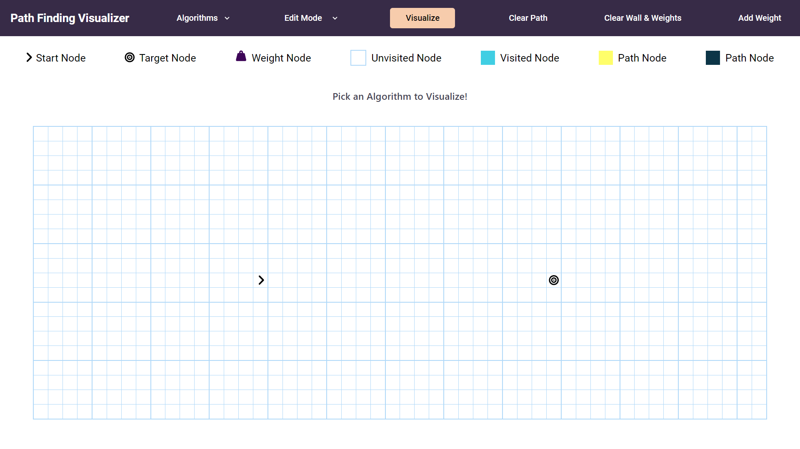

# Path Finding Visualizer 

### The Challenge

Users should be able to:

- Interact properly with the features and functioin of the UI.
- Properly Visualise the propagation of different path finding algorithms.
- Add and remove walls and weights according to the type of algorithm.
 

### Screenshot

### Links

- [Live Site URL](https://mdajmalshadab.github.io/PathFinding-Visualizer/)

## My Process

### Built with

- HTML5
- CSS
- React JS

### What I learned

- React Functional components and their reusability
- React file and folder structure
- Write different path finding algorithms on my own from scratch.
- Use of state to depict realtime rendering, thus enhancing user experience.
- CSS animations
- Analysing JS code for best implementation and visualization of all the algorithms.
- Adding and handling different mouse events.
- Use of inline styles with JS.
